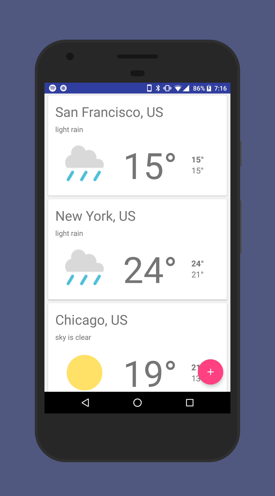

# android-weather-app
> A simple weather android app inspired in material design

 

# Requirements
 - Android 5.0 (API 21) or above 
 - Build with Android Studio 3.0 Beta 2
 
# Features
 - Material Design
 - Add your favorites cities 
 - Android Cards
 - Refresh gestures pulling down from the top
 - Swipe to delete 
 - Snack to undo delete
 - Some meaningful animations
 - Simple and clean 

# Disclaimer 
- No data persistent was implement, still work in progress 
- Cities will be lost when you terminate the app process

# Tested 
- Nexus 6P running Android O 8.0 stock

## Built With

* [Butter Knife](https://github.com/JakeWharton/butterknife) - Field and method binding for Android views
* [Retrofit](http://square.github.io/retrofit/) - A type-safe HTTP client for Android and Java
* [OpenWeatherMap](https://openweathermap.org/) - Weather API used 
* [Gson](https://github.com/google/gson) - A Java serialization/deserialization library to convert Java Objects into JSON and back
* [Picasso](http://square.github.io/picasso/) - A powerful image downloading and caching library for Android

## Acknowledgments
* Inspiration Simple Weather App
* MaterialDesignDemo by Eajy

## Licence
MIT &copy; martinruiz
